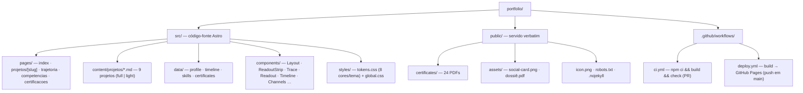

# Portfólio — Rene Verinaud Anguita Junior

Página pessoal de Rene Verinaud Anguita Junior (Cientista de Dados, Ph.D. em
Engenharia Elétrica). Site estático construído com **[Astro](https://astro.build)**.

- **Publicado:** <https://rvanguita.github.io/portfolio/>
- **GitHub:** <https://github.com/rvanguita> · **LinkedIn:** <https://linkedin.com/in/rvanguita>

## Conceito

Um **painel de leitura** — o site se lê como o painel frontal de um instrumento
de precisão: cada página é um painel, a métrica-chave de cada projeto aparece
como uma leitura numérica grande com unidade, traços de sinal (SVG inline)
ecoam cada resultado, e uma barra fixa no topo carrega a identidade e a
navegação. Acento ciano, hairlines, tipografia IBM Plex (Sans + Mono).
Tema claro/escuro com alternância em CSS puro, sem JavaScript no cliente.

## Estrutura



O site é servido sob `/portfolio/`. Todo link interno passa pelo helper
`src/lib/url.ts` para ganhar esse prefixo; URLs absolutas (canonical, Open
Graph) usam `Astro.site`.

## Conteúdo

Todo o texto do site mora em dados estruturados, não no HTML:

- `src/data/profile.ts` — perfil, contato, disponibilidade
- `src/data/timeline.ts` — as 9 entradas da trajetória, com o eixo de tempo
- `src/data/skills.ts` — os 4 grupos de competências
- `src/data/certificates.ts` — as 24 certificações, em 3 grupos (12 / 9 / 3)
- `src/content/projetos/*.md` — os 9 projetos curados. `kind: full` traz o estudo
  de caso completo no corpo Markdown; `kind: light` traz só a ficha
  problema/dados/método/resultado no frontmatter. `repo:` liga o card ao
  repositório no GitHub.

## Sincronização com o GitHub

O usuário do GitHub vem de `src/data/profile.ts`. Um snapshot versionado
(`src/data/github-repos.json`, gerado por `npm run sync`) alimenta:

- **cards curados** — `★`, linguagem e "atualizado há X" ao vivo;
- **seção "Mais no GitHub"** — todo repositório público **sem** card curado
  aparece sozinho (nome, descrição, linguagem, data, ★).

O build nunca chama a API — lê só o JSON. Um workflow semanal
(`.github/workflows/sync-github.yml`) relê a API e abre um PR quando algo muda.
Controle pela UI do GitHub: topic **`portfolio-hide`** esconde um repo,
**`portfolio-pin`** o destaca. `portfolio`, `rvanguita`, forks e arquivados
ficam sempre de fora.

> Uma vez: em *Settings → Actions → General → Workflow permissions*, marcar
> "Allow GitHub Actions to create and approve pull requests".

## Rodar localmente

```bash
npm install
npm run dev        # desenvolvimento (rápido)
npm run build && npm run preview   # confere o site sob /portfolio/
npm run check      # astro check (tipos)
npm run sync       # regenera src/data/github-repos.json a partir da API
```

Node: `mise.toml` fixa a versão para o desenvolvimento local; o CI usa Node 20.

## Publicar

Push em `main` → `.github/workflows/deploy.yml` roda `npm ci && npm run build` e
publica `dist/` no GitHub Pages. Pull requests para `main` passam por
`.github/workflows/ci.yml` (`npm ci && npm run build && npm run check`): um link
interno quebrado, uma violação de schema de conteúdo ou um erro de tipo derruba
o build. A proteção da branch `main` exige esse check.
`.github/workflows/sync-github.yml` roda semanalmente e mantém o snapshot dos
repositórios em dia via PR.

## Licença

Portfólio pessoal e materiais profissionais. Para reutilização de conteúdo,
imagens ou certificados, entre em contato com o autor.
