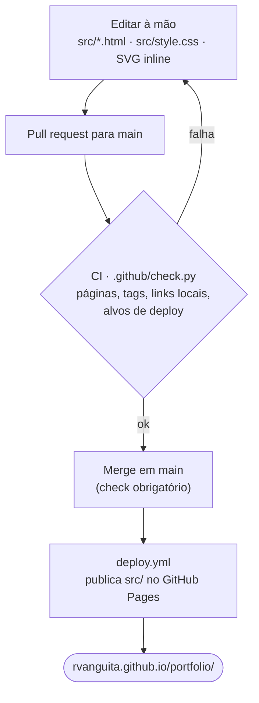
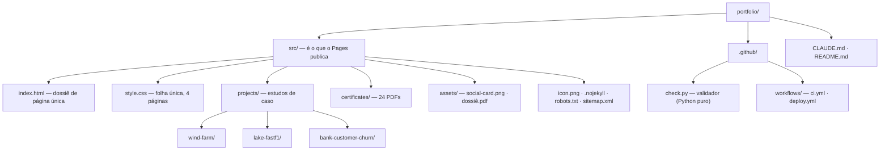

# Portfólio — Rene Verinaud Anguita Junior

Página pessoal de Rene Verinaud Anguita Junior (Cientista de Dados, Ph.D. em
Engenharia Elétrica). Site estático escrito à mão — **só HTML e CSS**, sem
framework, sem build, sem dependências.

- **Publicado:** <https://rvanguita.github.io/portfolio/>
- **GitHub:** <https://github.com/rvanguita> · **LinkedIn:** <https://linkedin.com/in/rvanguita>

## Como é feito

Fluxo de ponta a ponta, sem build: editar HTML/CSS à mão, abrir PR, o CI valida,
o merge publica.



## Estrutura



Em detalhe:

```
src/                             fonte do site — é o que o Pages publica
  index.html                     página única ("dossiê"): intro · projetos ·
                                 trajetória · competências · certificações
  style.css                      folha única, compartilhada pelas 4 páginas
  projects/wind-farm/index.html  estudo de caso (prosa curta + link do repo)
  projects/lake-fastf1/index.html  estudo de caso
  projects/bank-customer-churn/index.html  estudo de caso
  certificates/                  24 PDFs de certificado, em subpastas
  assets/social-card.png         imagem de compartilhamento (Open Graph)
  assets/dossie-rene-anguita.pdf  snapshot do site inteiro em PDF
  icon.png                       favicon
  .nojekyll                      impede o GitHub Pages de rodar Jekyll
  robots.txt                     permite rastreio; aponta para o sitemap
  sitemap.xml                    mapa do site para buscadores
.github/check.py                 validador do site (Python puro, sem deps)
.github/workflows/ci.yml         roda o check.py em cada PR para main
.github/workflows/deploy.yml     publica src/ no GitHub Pages (sem build)
CLAUDE.md                        guia para agentes de código
```

Todos os links (navegação, CSS, favicon, PDFs) são **relativos** — o site
funciona igual localmente e sob `/portfolio/`. URLs absolutas só nos
`<meta og:*>` e no `<link rel="canonical">`.

## Projetos

Os seis projetos em destaque no site, todos com repositório público:

- **FastF1 Data Platform** — Lakehouse & MLOps: dados de Fórmula 1 em Delta Lake,
  orquestração no Airflow, rastreio no MLflow, API FastAPI e painel Streamlit.
  [Estudo de caso](projects/lake-fastf1/) ·
  [repo](https://github.com/rvanguita/lake-fastf1)
- **Modelagem da Geração de Energia Eólica** — regressão para prever a geração de
  quatro turbinas ao longo de um ano (XGBoost, SHAP, validação por janela
  expansível).
  [Estudo de caso](projects/wind-farm/) ·
  [repo](https://github.com/rvanguita/wind-farm)
- **Bank Customer Churn Prediction** — classificação do risco de evasão de
  clientes de um banco (CatBoost, LightGBM, XGBoost, SHAP, MLflow, Docker).
  [Estudo de caso](projects/bank-customer-churn/) ·
  [repo](https://github.com/rvanguita/bank-customer-churn)
- **Otimização de Sistemas de Distribuição Elétrica** — pesquisa operacional do
  mestrado e do doutorado (AMPL, CPLEX, Busca Tabu, metaheurísticas).
  [INDUSCON 2025](https://github.com/rvanguita/induscon_2025) ·
  [reliability-systems](https://github.com/rvanguita/reliability-systems) ·
  [DEP-TS-MDM](https://github.com/rvanguita/DEP-TS-MDM)
- **Credit Card Fraud Detection** — detecção de fraude num dataset real
  fortemente desbalanceado (PCA, machine learning).
  [repo](https://github.com/rvanguita/fraud-detection)
- **Sentiment Identification NLP** — classificação de sentimento de avaliações de
  e-commerce (dataset Olist; TF-IDF, XGBoost, Optuna).
  [repo](https://github.com/rvanguita/sentiment-identification-nlp)

## Editar

Abra `index.html` (ou uma das páginas em `projects/`) e edite o texto direto no
HTML. A aparência inteira está em `style.css` (~400 linhas). O conceito é um
"caderno em papel milimetrado": a página assenta sobre um grid CSS tênue, os
divisores de seção são eixos rotulados, a prosa é serifada e toda medição é
monoespaçada. Variáveis CSS no topo: `--paper` `--ink` `--ink-soft` `--rule`
`--grid` `--grid-bold` `--accent` (cobre, texto) / `--accent-ink` (cobre,
gráficos), mais a escala `--fs-*` e as medidas de largura `--canvas` (largura da
página em telas largas), `--rail` / `--rail-gap` (a calha do rótulo de seção e o
eixo-y) e `--measure` (cap de leitura da prosa). Gráficos são SVG inline — sem
arquivos de imagem.

A partir de `60rem` de viewport a página vira um plano cartesiano largo: um só
bloco `@media screen and (min-width: 60rem)` (impressão fica de fora), o rótulo
de cada seção migra para a calha `--rail` fixa à esquerda, e o esquema do hero
(SVG + legenda, agrupados num `<div class="intro-mark">` nas 4 páginas) vai para
a margem. Abaixo de `60rem` o layout é idêntico ao de antes.

- **Novo certificado:** coloque o PDF em `certificates/`, adicione um `<li>` na
  seção **Certificações** do `index.html` (troque espaços por `%20` no `href`) e
  atualize a contagem no `<summary>`, o `[24]` do `.axis-fig` e o segmento
  correspondente da `.cert-bar` / `.cert-legend`.
- **`<head>` e rodapé** são copiados nas 4 páginas — ao mexer num, mexa nas quatro.

## Ver localmente

```bash
python3 -m http.server 8000 -d src   # na raiz do repo
```

Abra <http://localhost:8000/>. Ou abra `src/index.html` no navegador.

## Publicar

Push em `main` → `.github/workflows/deploy.yml` publica o diretório `src/`
(que já é o site, com `.nojekyll`) no GitHub Pages. Também dá para disparar
manualmente pelo Actions (`workflow_dispatch`).

Pull requests para `main` passam por `.github/workflows/ci.yml`, que roda
`python3 .github/check.py`: confere que as 4 páginas existem, têm tags
balanceadas, um só `<h1>`, `lang="pt-BR"` e `<title>`; que todo link local
aponta para um arquivo real; e que os alvos do deploy existem. Sem npm. A
proteção da branch `main` exige esse check.

## Licença

Portfólio pessoal e materiais profissionais. Para reutilização de conteúdo,
imagens ou certificados, entre em contato com o autor.
